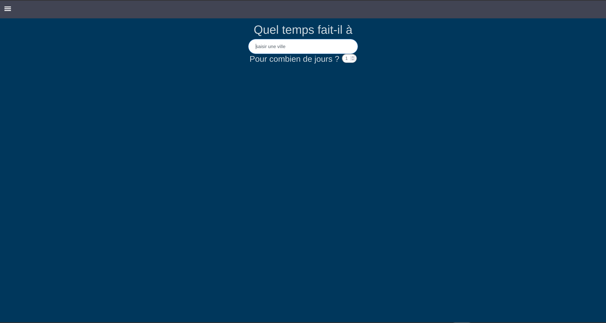
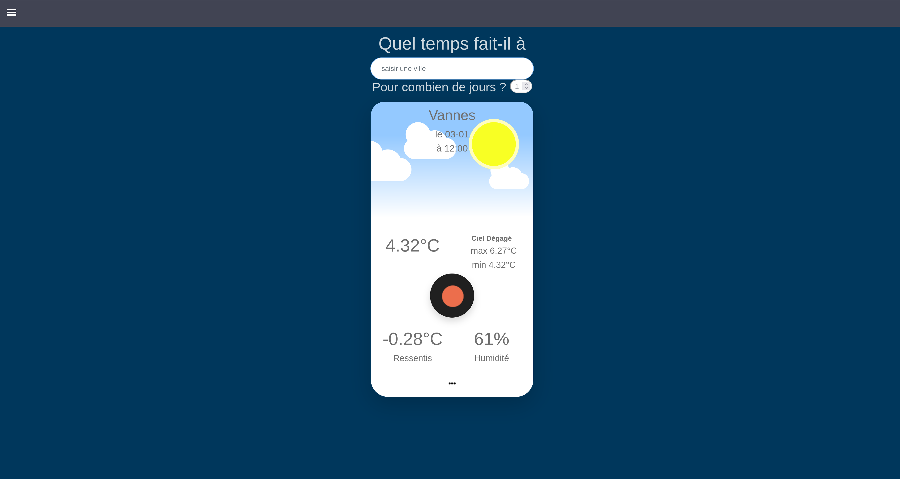
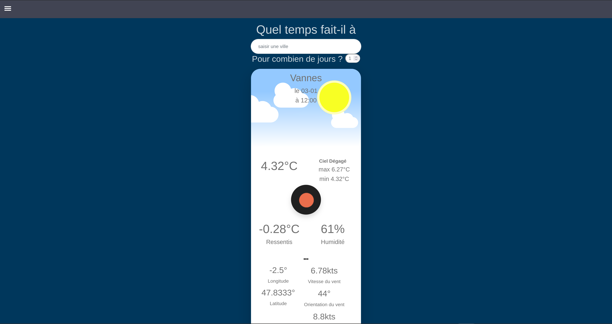
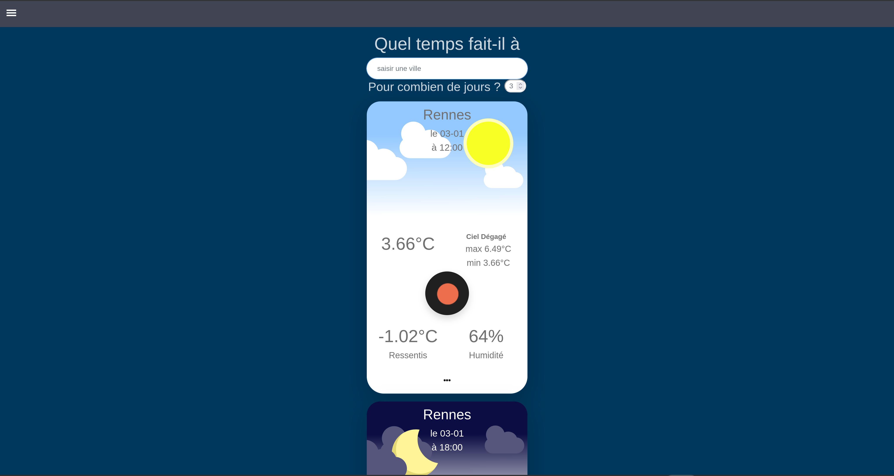
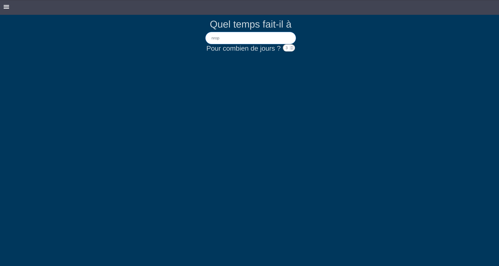

POULAIN Thomas, JAMET Titouan
***

# Installation
Pour l'installation de notre application, vous devez extraire le .zip puis lancer l'index.html présent.

# Utilisation

### 1) Page d'accueil

La page sur laquelle vous êtes arrivés après avoir suivis les informations précédentes devrait être la suivante:
***

***
C'est dans la **barre de recherche**, au millieu, que vous pouvez entrer le nom de la ville que vous souhaitez. Cliquez sur le **bouton** "valider" pour effectuer la recherche et afficher diverses  informations météorologiques.

Parmi les informations affichées, vous retrouverez une sélection des informations les plus importantes telles que:

- Le nom de la ville avec le pays associé
- La date et l'heure de la prévision
- Un bref descriptif du temps (nuageux, ensoleillé etc..) représenté également par un symbole
- La température actuelle et le ressentis
- Les températures maximales et minimales
- L'humidité

***

***

En bas du panel d'information de la carte, se trouve une icône: "...". Ce bouton permet d'afficher un second panel sous la carte, dans lequel se situe diverses informations complémentaires au sujet de la ville désirée.

***

***

Parmi les informations complémentaires, vous retrouverez:

- Les coordonnées de la ville
- La force du vent
- L'orientation du vent
- La force des rafales

> **Il est possible de masquer ces informations complémentaires en réappuyant sur le même bouton.**

Pour changer de ville, il suffit de rentrer une nouvelle ville dans la barre de recherche et de valider, les nouvelles informations remplaceront les anciennes.
***

***

> **/!\\ Il se peut que la ville entrée ne soit pas connue par l'API d'Openweather, aucune cartes ne s'affichera alors.**

***

***

Un deuxième champs de saisie permet de changer le nombre de jours couvert par les prédictions.

***

***
### 2) Page de contact

Cette page, accessible via le menu, permet d'accéder aux noms, photos de profils et groupes des deux créateurs (nous-même)

### 3) Page d'aide

Cette page, également accessible via le menu permet de rediriger l'utilisateur vers le site web du fournisseur de l'API pour plus d'informations ou pour toute demande de réclamation vis-à-vis des informations.